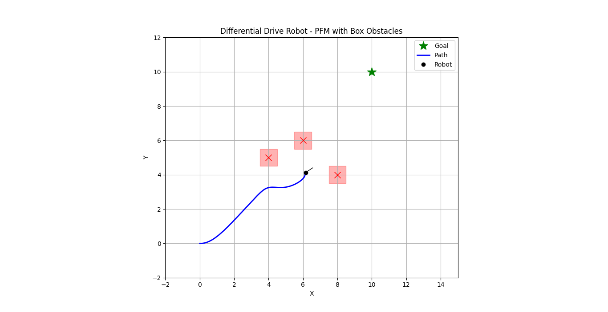

# 🧠 Differential Drive Robot Path Planning using Potential Field Method (PFM)

This project simulates a **differential drive robot** navigating a 2D environment using the **Potential Field Method (PFM)**. The robot is guided toward a goal while avoiding obstacles using artificial attractive and repulsive forces.

---

## 📌 Features

- Differential drive kinematics (heading + linear/angular velocities)
- Goal-seeking behavior using attractive potential
- Obstacle avoidance using repulsive potential
- Obstacle representation as **boxes** (for realistic visuals)
- Local minima avoidance using perturbation
- Real-time animation using `matplotlib.animation`

---

## 📽️ Demo

A robot starts from the origin `(0, 0)` and navigates to the goal `(10, 10)` while avoiding red box obstacles in the environment. The simulation shows:

- Robot trajectory
- Robot heading
- Goal and obstacles
- Live animation using Matplotlib

---

## 🔧 How It Works

### 🚀 Potential Field Method

- **Attractive Force**: Pulls the robot toward the goal.
  
  \[
  \vec{F}_{att} = -k_{att} \cdot (\vec{position} - \vec{goal})
  \]

- **Repulsive Force**: Pushes the robot away from obstacles if they are within a certain influence radius.

  \[
  \vec{F}_{rep} = k_{rep} \cdot \left( \frac{1}{\rho} - \frac{1}{\rho_0} \right) \cdot \frac{1}{\rho^2} \cdot \hat{\rho}
  \]

- The total force is used to compute desired heading and velocity for differential drive motion.

---

